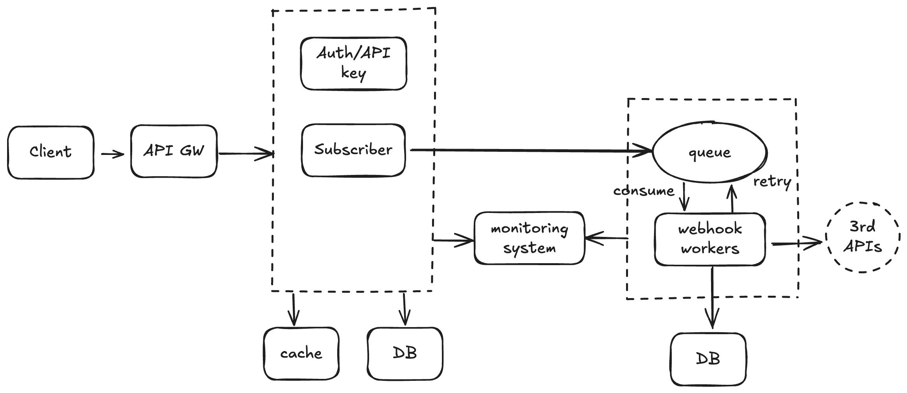

# Webhook Notifier System Design
## I. Introduction
### 1. System Overview
- The system is a comprehensive backend platform designed to enable customers to manage their email subscribers and facilitate integrations with external platforms. The system serves as the backbone for subscriber CRUD operations, and real-time webhook notifications to partner systems.

### 2. Purpose and Objectives
The primary objectives of this system are to:

- Provide a robust web-based interface for subscriber management through internal APIs
- Support external integrations via public APIs with multiple authentication methods (OAuth2 and API keys)
- Deliver reliable, scalable, and fair webhook notifications to external systems
- Ensure high availability and security for all customer data and operations
- Scale efficiently to handle customers ranging from hundreds to hundreds of thousands of subscribers

### 3. Architecture selection
- Monolith vs Microservices: We chose a microservices architecture to enable independent scaling and technology choices per component, accepting increased complexity in service coordination and deployment management.

- Event-driven vs Synchronous: Selected event-driven architecture for webhook processing to ensure system resilience and scalability, trading off immediate consistency for eventual consistency in some scenarios.- 

## II. Requirements
### 1. Functional requirements
- **Subscriber Management**: Complete CRUD operations for subscriber data with validation and deduplication
- **Webhook Delivery**: Real-time event notifications with configurable endpoints and event types
- **Retry Mechanisms**: Intelligent retry logic for failed webhook deliveries with exponential backoff
- **Multi-tenant Architecture**: Complete data isolation between customer accounts
- **Audit Logging**: Comprehensive logging of all API operations and administrative actions

### 2. Non-Functional Requirements
- **Reliability**: A retry mechanism should be in place in case the system fails or there are networking issues from integration partners.
- **Scalability**: Support for 10,000+ concurrent users and 1M+ webhook deliveries per hour.
- **Fairness**: Prevent large accounts from monopolizing system resources.
- **Data Consistency**: ACID compliance for critical operations, eventual consistency acceptable for webhook delivery.
- **Availability**: 99.9% uptime with automated failover capabilities.

In this design, I did allow system to have **some limitations**:
- **Authentication Support**: Dual authentication mechanisms supporting both OAuth2 for partner integrations and API keys for private integrations are not in the scope of this design document.
- **No Order Guarantee**: system does not guarantee any order for webhook events.
- **Handle HTTP/S communication only**: sending webhooks in any other type of communication manner (e.g., send to queue, TCP, etc.) will not be supported.

## III. High level archtecture
### 1. High-level architecture diagram

### 2. Core components
- **API Gateway** serves as the single entry point, providing centralized routing, rate limiting, and authentication verification. This approach simplifies client interactions but creates a potential single point of failure, which we mitigate through load balancing and redundancy.
- **Subscriber service** maintains authoritative subscriber data and publishes change events to the message queue.
- **Auth Service** centralizes authentication logic, reducing code duplication across services but creating a critical dependency that requires high availability design. It also handles complete key lifecycle management with encrypted storage and comprehensive audit trails.
- **Webhook Workers** processes and delivers subscriber events using sophisticated queuing and fairness algorithms.
- **Message Queue** (redis) is used to queue tasks and manage communication between producers (task senders) and consumers (task workers).

## IV. Component Design
### 1. API Gateway
- The API Gateway implements intelligent routing based on authentication context, directing requests to the respective API Services. It performs initial request validation, rate limiting enforcement, and security header injection.

- Trade-offs: Centralized gateway simplifies client interactions and security enforcement but can become a bottleneck. We address this through horizontal scaling API Gateway or adding Load Balancer layer before API Gateway.

- Data Flow: Incoming requests are authenticated, validated, and routed to appropriate backend services. Response aggregation and transformation can occur before returning to clients.

### 2. Auth Service
- This service handles multiple authentication flows including session management for web applications, OAuth2 authorization flows for partner integrations, and API key validation for private integrations. Token management includes generation, validation, refresh, and revocation capabilities.

- Trade-offs: Centralized authentication provides consistency and easier security updates but creates a critical dependency. We mitigate this through service redundancy and graceful degradation patterns (session caching).

### 3. Webhook Workers
#### a. Traditional architecture

- In a conventional system design, the request handler is responsible for directly managing incoming requests, executing the relevant business logic, and saving the outcomes to the database. While this method may seem efficient, it presents several critical issues:

    - Strong Coupling: The integration of request handling with business logic complicates independent scaling of components.
    - Single Point of Failure: A failure in the request handler can cause the entire system to become unresponsive.
    - Insufficient Load Handling: During periods of high traffic, the system can be overwhelmed, resulting in potential breakdowns.
    - Absence of Automatic Retries: When an operation fails, there is often no automated process to retry the event.

#### b. A resilient architecture with message queue

- To tackle the above issues, incorporating a message queue into the architecture can greatly improve the performance and reliability of the webhook service. Here’s how this integration functions:

    - Decoupling: Rather than processing events directly, the request handler places messages into a queue. This separation allows request handling and event processing to operate independently, facilitating scalable solutions.
    - Load Buffering: The message queue serves as a buffer, storing incoming requests during high-traffic periods, which helps the system manage bursts of activity without experiencing failures.
    - Scalability: Additional consumers can be introduced to handle messages from the queue, allowing for horizontal scaling as demand grows.
    - Failure Recovery: If an event fails to process, the message can be automatically retried, ensuring that delivery occurs at least once.

- Advantages of Message Queue Integration
    - Increased Reliability: A message queue effectively manages traffic surges, reducing the risk of service disruptions.
    - Greater Flexibility: Components can evolve independently, making maintenance and upgrades easier.
    - Optimized Resource Use: Offloading processing to the queue keeps the request handler responsive, improving overall system performance.

#### c. Data flow of the improved architecture

- Webhook trigger and API request:
    - When an event occurs in the customer/3rd side, the webhook sends an API request to the service with the event data.
- Enqueue Event:
    - When a request is received, the webhook places the message into the message queue.
        - Success Case: If the message is successfully added to the queue, the system sends a 200 response back to the user, confirming that the event has been received and will be processed.
        - Failure Case: If the message cannot be enqueued (for example, due to a disruption in the queue service), the system responds with an appropriate error code (such as a 500 Internal Server Error). This indicates to the user that the event was not processed successfully.
- Event Processing: 
    - Fetches webhook events from a queue.
    - Identifies the subscribers for the event type.
- Webhook Delivery:
    - Sends HTTP POST requests to the subscriber endpoints with the event payload.
    - Handles retries for failed deliveries using exponential backoff.
- Error Handling:
    - Logs errors and updates the delivery status in the database.
    - Ensures failed deliveries do not block other events.
- Status Tracking:
    - Tracks the delivery status (`pending`, `delivered`, `failed`) and the number of attempts for each webhook.

### 4. Storage Design Strategy
- The system uses a hybrid approach with transactional data in PostgreSQL for ACID compliance and Redis for session storage and caching. This provides strong consistency for critical operations while enabling high-performance read operations.

- Trade-offs: Multiple data stores increase operational complexity but provide optimal performance characteristics for different use cases. A single database would be simpler but would compromise either consistency or performance.

## V. Database Design
### 1. Data model
- Detailed data models can be found [here](/app/models.py)
### 2. Redundancy 
- To improve high availability (HA) and performance, database sharding or replication can be implemented. Sharding involves splitting the database into smaller, more manageable pieces (shards), each responsible for a subset of the data. This allows for horizontal scaling and reduces the load on individual database nodes. Replication, on the other hand, involves creating multiple copies of the database (replicas) to distribute read operations and provide redundancy. By combining sharding and replication, systems can achieve better fault tolerance, faster query performance, and enhanced scalability, ensuring uninterrupted service even during high traffic or partial system failures.
- Trade off: Sharding and replication offer complementary benefits but come with trade-offs. Sharding enables horizontal scaling by distributing data across multiple shards, reducing the load on individual nodes and improving performance. However, it increases operational complexity, especially for cross-shard queries and rebalancing data. Replication enhances fault tolerance and read performance by creating multiple copies of the database, but it introduces challenges like replication lag and higher storage requirements. Combining both strategies provides scalability, redundancy, and high availability but requires careful management to handle the added complexity and ensure consistency.

## VI. API Design
- API design can be found in [openapi.yaml](/openapi.yaml) file or http://localhost:8000/docs.

## VII. Reliability
- To ensure system reliability, serveral techniques can be applied:
### 1. Retry Logic
- Implement exponential backoff for retries to avoid overwhelming the system or integration partner.
- Define a maximum number of retries to prevent infinite loops.
- Log each retry attempt for debugging and monitoring purposes.
### 2. Error Handling
- Catch specific exceptions (e.g., httpx.RequestError, SQLAlchemyError) to handle known failure scenarios.
- Use a fallback mechanism to store failed events for later processing (e.g., a dead-letter queue or database table).
### 3. Idempotency
- Ensure retries do not result in duplicate processing by checking for existing records (e.g., webhook deliveries) before creating new ones.
### 4. Monitoring and Alerts
- Log failed retries and send alerts for persistent failures (Prometheus, Grafana, Sentry) to notify the team.
### 5. Integration with Celery
- Celery is used in this service for its ability to handle asynchronous task processing, which is crucial for reliability and scalability. Specifically:
    - Asynchronous Processing: Celery allows webhook events to be processed in the background without blocking the main application, ensuring responsiveness.
    - Retry Mechanism: Celery provides built-in support for retries with exponential backoff, improving reliability in case of transient failures
    - Task Scheduling: Celery can schedule tasks for delayed execution, which is useful for retrying failed webhook deliveries.
    - Scalability: Celery workers can be scaled horizontally to handle high volumes of webhook events.
- Alternative solutions of Celery and their trade-offs:
    - Celery: Offers a balance of features and flexibility but requires managing a message broker (e.g., RabbitMQ, Redis) and worker infrastructure.
    - AWS SQS/Lambda: Simplifies infrastructure management but limits customization and introduces vendor lock-in.
    - Kafka: Provides high scalability but adds operational complexity.
    - Redis Queue: Simple and lightweight but lacks advanced features for large-scale systems.
    - Custom Implementation: Offers full control but is time-consuming to develop and maintain.

## VIII. Scalability and Performance
### 1. Horizontal Scaling Strategies
- All services are designed as stateless containers that can be horizontally scaled based on demand metrics. The webhook processing system implements dynamic scaling based on queue depth and processing latency, automatically spawning additional workers during high-volume periods.

- Trade-offs: Automatic scaling provides optimal resource utilization but can introduce temporary performance degradation during scaling events. We balance this through predictive scaling based on historical patterns and gradual scale-up policies.
### 2. Caching strategy
- Multi-layer caching includes API response caching in Redis, database query result caching, and CDN caching for static assets or large payload. Large payload can be also stored in blob storage like S3, their url can be included in data sent to configured webhook.
- Trade-offs: Aggressive caching improves performance but introduces complexity in cache coherency management. We implement cache invalidation strategies that prioritize data consistency (LRU, LFUqs) while maintaining performance benefits.

## IX. Fairness
### 1. Rate Limiting
- The `WebhookNotifier` class ensures fairness by introducing delays for webhook processing based on the subscriber count of the user. Larger accounts with more subscribers are assigned longer delays to prevent monopolization of resources.
- Rate limiting can be applied for both incoming and outcoming requests to make sure that the system doesn't push pressures on webhook APIs.

### 2. Priority Queuing
- Two separate Celery queues are used:
  - `webhooks_priority`: For high-priority events, typically for smaller accounts or critical events.
  - `webhooks`: For lower-priority events, typically for larger accounts with rate-limited processing.
- This ensures that smaller accounts or critical events are not delayed by the processing of larger accounts.

### 3. Load Balancing
- Celery's task routing ensures that tasks are distributed across workers based on the queue configuration. This prevents overloading specific workers and ensures fair resource utilization.

### 4. Fair Retry Mechanism
- Retries for failed webhook deliveries use exponential backoff (`[1, 5, 25, 125, 625]` seconds). This prevents retries from overwhelming the system and ensures fair reprocessing of tasks across all users.

### 5. Idempotency
- The implementation ensures idempotency by checking for existing webhook deliveries before creating new ones. This prevents duplicate processing of the same event, ensuring fairness in resource usage.

### 6. Monitoring and Alerts
- Logs are generated for each webhook event, including retries and failures. This allows monitoring of resource usage and detection of unfair resource allocation.
- Alerts can be configured for anomalies, such as excessive retries or failures for specific users.

### 7. Subscriber-Based Delays
- The `_calculate_delay` method in `WebhookNotifier` dynamically calculates delays based on the subscriber count:
  - Accounts with over 100,000 subscribers: 30 seconds delay.
  - Accounts with over 50,000 subscribers: 15 seconds delay.
  - Accounts with over 10,000 subscribers: 5 seconds delay.
  - Smaller accounts: No delay.
- This ensures that larger accounts do not overwhelm the system, maintaining fairness for smaller accounts.

## X. Monitoring

### 1. Performance Metrics
- **Task Processing Time**: Measure the time taken to process each webhook event, from task creation to completion. This helps identify bottlenecks in the system.
- **Queue Depth**: Monitor the number of tasks in each Celery queue (`webhooks_priority` and `webhooks`) to ensure tasks are being processed in a timely manner.
- **Worker Utilization**: Track the CPU and memory usage of Celery workers to detect resource constraints.

### 2. Latency Metrics
- **Webhook Delivery Latency**: Measure the time from when a webhook event is triggered to when it is successfully delivered to the integration partner.
- **Retry Latency**: Track the delay between retries for failed webhook deliveries to ensure the retry mechanism is functioning as expected.

### 3. Logging
- **Event Logs**: Log details for each webhook event, including event ID, user ID, processing time, and delivery status (success, failure, or retry).
- **Error Logs**: Capture detailed error messages for failed webhook deliveries to aid in debugging and root cause analysis.

### 4. Alerts and Notifications
- **Queue Depth Alerts**: Trigger alerts if the queue depth exceeds a predefined threshold, indicating potential delays in task processing.
- **Task Failure Alerts**: Notify the team if the failure rate for webhook deliveries exceeds a certain percentage.
- **Worker Health Alerts**: Monitor worker health and send alerts if any worker becomes unresponsive or overloaded.

### 5. Tools and Dashboards
- **Prometheus and Grafana**: Use Prometheus to collect metrics and Grafana to visualize them in real-time dashboards. Key metrics include task processing time, queue depth, and worker utilization.
- **ELK Stack (Elasticsearch, Logstash, Kibana)**: Aggregate logs using Logstash, store them in Elasticsearch, and analyze them with Kibana for detailed insights.
- **Sentry**: Use Sentry for error tracking and alerting on webhook delivery failures or system exceptions.

### 6. Synthetic Testing
- Periodically send synthetic webhook events to measure end-to-end latency and ensure the system is performing as expected under normal conditions.

## XI. Deployment
### 1. Deployment Architecture
- The system deploys to Kubernetes clusters in multiple availability zones for high availability. Container orchestration enables zero-downtime deployments through rolling updates and blue-green deployment strategies.
- Trade-offs: Kubernetes provides excellent scalability and deployment flexibility but introduces significant operational complexity compared to simpler deployment approaches.
### 2. Cloud Strategy
- Multi-cloud deployment across major providers prevents vendor lock-in while leveraging best-of-breed services. Database services use managed offerings for reduced operational overhead while maintaining control over critical configurations.
- Trade-offs: Multi-cloud increases complexity and costs but provides better resilience and negotiating power with cloud providers.

## XII. Conclusion
- The Webhook Notifier System Design addresses all core requirements while providing a foundation for future growth and feature expansion. The microservices architecture enables independent scaling of components based on specific performance characteristics and load patterns.

- Key design decisions prioritize scability and reliability while maintaining security and performance requirements across diverse customer segments. The webhook fairness algorithm represents a novel approach to ensuring equitable service delivery in multi-tenant systems with widely varying customer sizes.

- The system's modular design enables gradual migration from existing systems and provides flexibility for future feature additions. Comprehensive monitoring and testing strategies ensure system reliability while supporting rapid development cycles.

